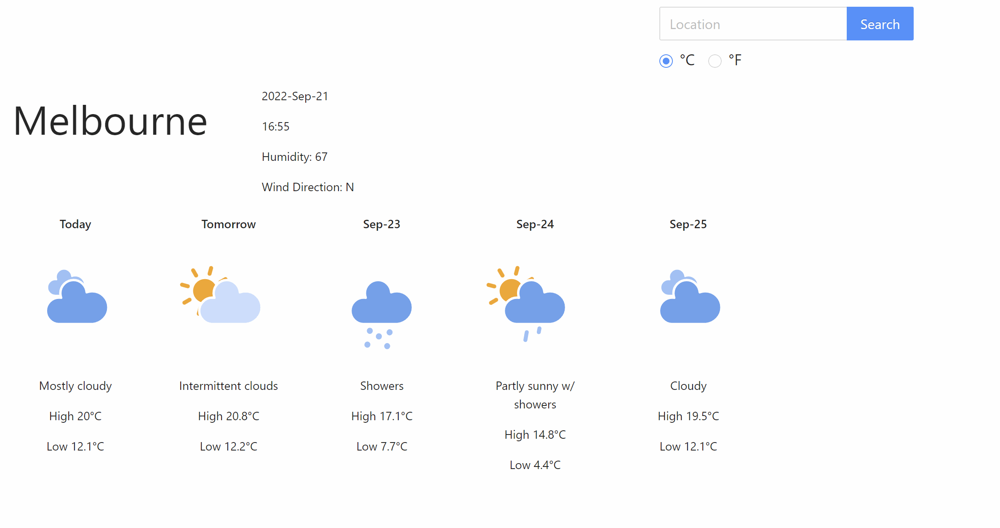

## Important config.json details
There are 4 keys inside the config.json file, as each key is good for 50 calls/ day
if the page is not refreshing, please change the api_key value to other keys

## Available Scripts

In the project directory, you can run:
### `npm install`
Install the dependencies

### `npm start`
To start the app 

### `npm test`
To run the test suit

## API documentations 
Refer to /src/docs files.

Due to a recent change in the weather APIs, the industry standard for free tier is non longer 7 days.
The widget show the forecasts for 5 days instead.

## Accessibility Features
<ul>
<li>Typos are ranked based on closeness to actual cities name thanks to AccuWeather API, so Adelaid will return Adelaide, for example.
<li>The whole widget can be navigated with tab (and arrow key for unit selection)
<li>Each icon is given and alt value of relevant weather condition </ul>