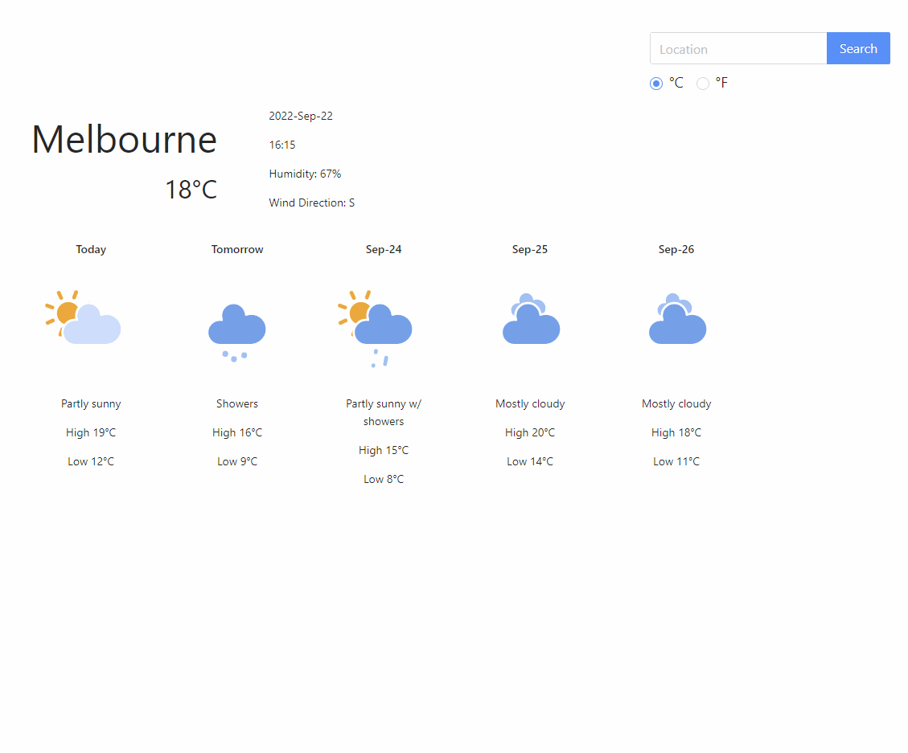
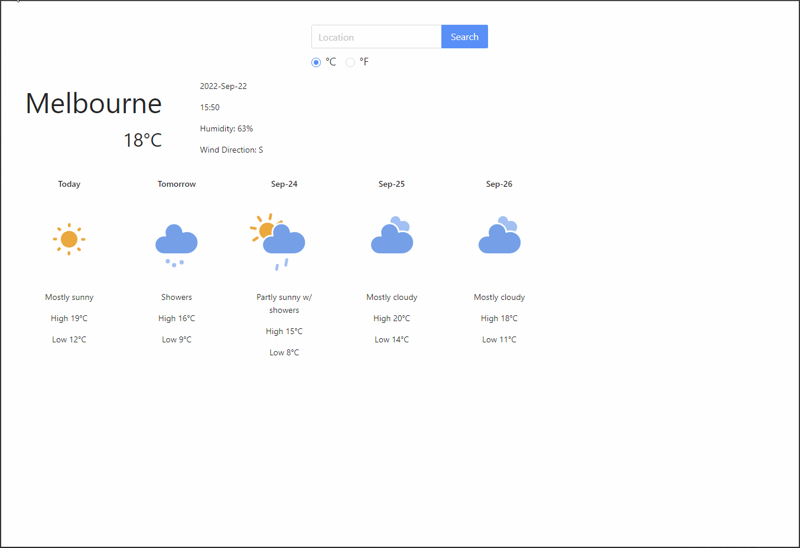

## Product Demo

## Important config.json details
There are 5 keys inside the config.json file, each key is good for 50 calls/ day. If the page is not refreshing, please change the api_key value to other keys.

The widget shows the forecast for 5 days instead of 7 days as the free tier of the most weather APIs currently only allows for maximum 5 days. OpenWeather API was used in this case.

## Accessibility Features
<ul>
<li>For users who uses screen reader, each  weather icon has an "alt" value that describes the weather condition. 
<li>For users with difficulties using mouse, they can navigate the site with Tab and Arrow keys.
<li>Users do not have to enter the exact location name as search result can return with the closest match. For example, if user enters Melboure, the results for Melbourne will be shown.</ul>

## Available Scripts

In the project directory, you can run:
### `npm install`
Install the dependencies.

### `npm start`
To start the app.

### `npm test`
To run the test suit.

## API documentations
Refer to /src/docs files.

## Components
WeatherWidgetDemoPage.js: Simulate a bigger website that take in WeatherWidget as a widget.

WeatherWidget.js & WeatherWidget.css: The Widget itself.

/docs: documentation for the weather API used.

/utils: utilities for unit conversions and API call for better readability.

/public/icon: icon pack for forecasts displays.